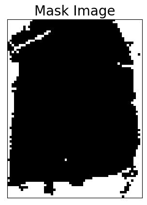
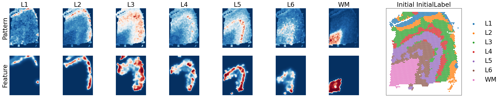
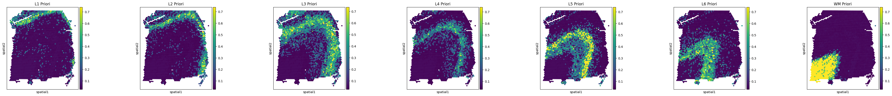
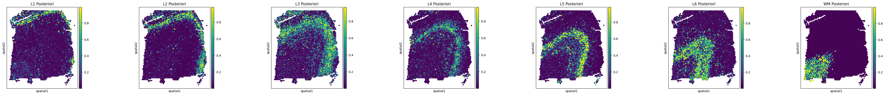
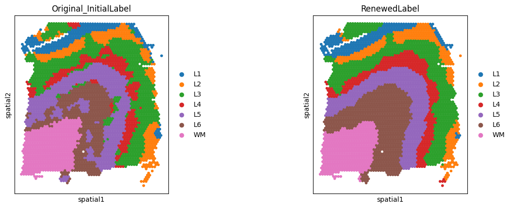

# Pianno: a probabilistic framework automating semantic annotation for spatial transcriptomics

------

`pianno` is a Python package that automatically annotates the biological identity of spots in spatial transcriptomics based on marker genes. 

[TOC]

# System Requirements

## Hardware Requirements

`pianno` package requires a computer with enough RAM to support the in-memory operations.

## Software Requirements

### OS Requirements

`pianno`  package is developped on *Linux* and has been tested on CentOS v7.5.1804 currently. The version suitable for other operating systems is under development. Stay tuned for updates on *https://github.com/yuqiuzhou/Pianno*.

### Python Dependencies

The following dependencies will be installed along with pianno.

```python
'anndata==0.8.0',
'matplotlib==3.5.1',
'numpy==1.19.5',
'opencv-python==4.5.5.64',
'pandas==1.4.1',
'rpy2==3.4.5',
'scanpy==1.9.1',
'scikit-image==0.19.2',
'scikit-learn==1.0.2',
'scipy==1.8.0',
'protobuf==3.20.3',
'squidpy==1.2.2',
'keras==2.6.0',
'tensorflow-gpu==2.6.0',
'tensorflow-probability==0.14.0'
```

### R Dependencies

Pianno uses the R packages `SAVER` and `scran` in preprocessing for noise reduction and size factor calculation, respectively. These two R packages will be automatically installed during the corresponding analysis in Pianno.

```python
'r-scran==1.28.2',
'r-saver==1.1.2'
```

### **Web Application**

The code of the demo is prototyped and explained on the Jupyter Notebook.


# Installation Guide

## Install from PyPi

```bash
# create an environment called Pianno
conda create -n Pianno python=3.9.10

# activate your environment
conda activate Pianno

# install R in the Pianno environment
conda install -c conda-forge r-base=4.1.1

# install tensorflow and tensorflow-probability
# ensure the version 2 of tensorflow
pip install tensorflow-gpu==2.6.0
pip install tensorflow-probability==0.14.0

# install pianno from PyPi
pip install pianno
```

The installation time-consuming tested on CentOS v7.5.1804 was 2m46.585s.


# Demo

Here we present our annotation process of sample 151674 from the human dorsolateral prefrontal cortex (dlPFC) dataset. The raw data are available at http://spatial.libd.org/spatialLIBD/. This demo demonstrates how to perform semantic annotation using Pianno takes a 10x Visium dataset as an example. You can expand to spatial transcriptome data generated by other platforms.

## Import Modules

```python
import pianno as po
```

## Step0：Create Pianno Object

###### A Pianno object is initialized based on the raw gene counts matrix and the coordinates of the spatial spots. pre-processing, including calculation of size factor and quality control, is also performed.

- **Input**


```python
data_path = "~/data/dlPFC-151674/"
count_file = "filtered_feature_bc_matrix.h5"
adata = po.CreatePiannoObject(data_path=data_path, count_file=count_file, min_spots_prop=0.01)
```

Expected run time: 0 h 0 min 60 s

- **Output**

```
[1] "load scran successfully"
```

- **Outcomes**

```python
# overview of the Pianno object
AnnData object with n_obs × n_vars = 3673 × 14711
    obs: 'in_tissue', 'array_row', 'array_col', 'n_counts', 'SizeFactor'
    var: 'gene_ids', 'feature_types', 'genome', 'n_cells'
    uns: 'spatial'
    obsm: 'spatial'
    layers: 'RawX'
```

| Key                     | Content                                            | Type   |
| :---------------------- | -------------------------------------------------- | ------ |
| adata.layers['RawX']    | row gene counts matrix                             | array  |
| adata.obsm['spatial']   | coordinates of spatial spots                       | array  |
| adata.obs['SizeFactor'] | size factor of spatial spots calculated by `scran` | series |

- **Notes**

For your own datasets that are not from 10x Visium, Pianno objects can also be constructed directly from a spot-by-gene raw counts matrix A and a spatial coordinates data frame B：

```python
adata = po.CreatePiannoObject(count_matrix=A, coordinates=B, min_spots_prop=0.01)
```


###### Noise reduction via SAVER.

- **Input**

```python
adata = po.SAVER(adata, layer_key='DenoisedX')
```

Expected run time: 2 h 17 min 23 s

This step will take a long time. We provide a denoised object which can be loaded with the following command if you don't want to wait:

```python
adata = sc.read("~/data/dlPFC-151674/adata.h5ad")
```

- **Output**

```
[1] "load SAVER successfully"
```

- **Outcomes**

```python
# overview of the Pianno object
AnnData object with n_obs × n_vars = 3673 × 14711
    obs: 'in_tissue', 'array_row', 'array_col', 'n_counts', 'SizeFactor'
    var: 'gene_ids', 'feature_types', 'genome', 'n_cells'
    uns: 'spatial'
    obsm: 'spatial'
    layers: 'RawX', 'DenoisedX'
```

| Key                       | Content                         | Type  |
| :------------------------ | ------------------------------- | ----- |
| adata.layers['DenoisedX'] | denoised gene expression matrix | array |

- **Notes**

You can also choose other methods of noise reduction and just store the spot-by-gene denoised matrix into `adata.layers['DenoisedX']`. Noise reduction of spatial transcriptome data is necessary for annotation. The result of noise reduction directly affects the annotation.


## Step1：Create Mask Image

###### A binary mask is created by establishing a mapping between spatial spots and image pixels.

- **Input**


```python
adata = po.CreateMaskImage(adata, scale_factor=1)
```

Expected run time: 0 h 0 min 1 s

- **Output**



    

- **Outcomes**

```python
# overview of the Pianno object
AnnData object with n_obs × n_vars = 3673 × 14711
    obs: 'in_tissue', 'array_row', 'array_col', 'n_counts', 'SizeFactor', 'spotID'
    var: 'gene_ids', 'feature_types', 'genome', 'n_cells'
    uns: 'spatial', 'Mask'
    obsm: 'spatial'
    layers: 'RawX', 'DenoisedX'
```

| Key                 | Content                                         | Type   |
| ------------------- | ----------------------------------------------- | ------ |
| adata.uns['Mask']   | tissue mask image                               | array  |
| adata.obs['spotID'] | pixel ID on the mask corresponding to each spot | series |

- **Notes**

This procedure is equivalent to binning spatial spots. For datasets whose spatial coordinates are array-like, the scale factor can be set to 1. For datasets whose spatial coordinates are not array-like, such as SlidseqV2 and stereo-seq, the scale factor can be increased until a suitable mask image is output.


## Step2：Pattern Recognition    

###### Input an user-designed Patterndict for initial annotation by pattern detector.

- **Input**


```python
Patterndict = dict(L1 = ['RELN','CXCL14'],
                   L2 = ['HPCAL1', 'C1QL2','CARTPT', 'PENK'],
                   L3 = ['NEFH', 'FREM3','SNCG','LGALS1'],
                   L4 = ['NEFH','RORB', 'VAMP1'],
                   L5 = ['TMSB10', 'PCP4', 'TRABD2A', 'CAMK2D'],
                   L6 = ['KRT17', 'NR4A2', 'SYNPR'],
                   WM = ['MOBP', 'MBP', 'PLP1', 'TF', 'CRYAB', 'CNP'])
```


```python
adata = po.SpatialPatternRecognition(adata, Patterndict=Patterndict,
                                     small_objects=2, dilation_radius=2,
                                     denoise_weight=0.2)
```

Expected run time: 0 h 0 min 2 s

- **Output**

    

- **Outcomes**

```python
# overview of the Pianno object
AnnData object with n_obs × n_vars = 3673 × 14711
    obs: 'in_tissue', 'array_row', 'array_col', 'n_counts', 'SizeFactor', 'spotID', 'InitialLabel', 'InitialLabel_Skeleton'
    var: 'gene_ids', 'feature_types', 'genome', 'n_cells'
    uns: 'spatial', 'Mask', 'PatternList', 'unknown_type', 'PatternImage', 'FeatureImage', 'InitialLabel_colors'
    obsm: 'spatial'
    layers: 'RawX', 'DenoisedX'
```

| Key                                | Content                                                     | Type   |
| :--------------------------------- | ----------------------------------------------------------- | ------ |
| adata.uns['FeatureImage']          | feature image                                               | array  |
| adata.uns['PatternImage']          | pattern image                                               | array  |
| adata.obs['InitialLabel']          | initial label of each spot obtained by the pattern detector | series |
| adata.obs['InitialLabel_Skeleton'] | the skeleton of initial annotation                          | series |

**Notes**

Markers and parameters can be adjusted based on the output of the initial label.


## Step3：Priori Initialization

###### Modeling the initial value of priori through the MRF.

- **Input**


```python
adata = po.PrioriInitialization(adata, label_key='InitialLabel',
                                omegaK=0.99, omegaG=0.01)
```

Expected run time: 0 h 0 min 21 s

- **Output**

```
---Create Spatial Graph: Done!
---Compute Spatial Energy: Done!
---Find K-Nearest Neighbor in UMAP: Done!
---Compute KNN Energy: Done!
---Compute Global Energy: Done!
WARNING: Please specify a valid `library_id` or set it permanently in `adata.uns['spatial']`
Elapsed time: 21.429s
```

    

- **Outcomes**

```python
# overview of the Pianno object
AnnData object with n_obs × n_vars = 3673 × 14711
    obs: 'in_tissue', 'array_row', 'array_col', 'n_counts', 'SizeFactor', 'spotID', 'InitialLabel', 'InitialLabel_Skeleton', 'L1 Priori', 'L2 Priori', 'L3 Priori', 'L4 Priori', 'L5 Priori', 'L6 Priori', 'WM Priori'
    var: 'gene_ids', 'feature_types', 'genome', 'n_cells'
    uns: 'spatial', 'Mask', 'PatternList', 'unknown_type', 'PatternImage', 'FeatureImage', 'InitialLabel_colors', 'spatial_neighbors', 'InitialLabel_PriorImage', 'InitialLabel_Energy'
    obsm: 'spatial'
    layers: 'RawX', 'DenoisedX'
    obsp: 'spatial_connectivities', 'spatial_distances', 'knn_connectivities'
```

| Key                      | Content                                                      | Type   |
| :----------------------- | ------------------------------------------------------------ | ------ |
| adata.obs[''XX Priori''] | the initial value of the priori that each spot belongs to “XX” pattern modeled by the MRF | series |

**Notes**

The larger the `omegaK,` the larger the effect of gene expression similarity on the initial value of priori, and the larger the `omegaG`, the larger the effect of initial annotation. A larger `omegaK` and a smaller `omegaG` are the recommended.


## Step4：Posteriori Inference

###### Based on the initial value of the prior, the posterior probability that each spot belongs to a different pattern is computed by Bayesian classifier.

- **Input**


```python
adata = po.PosterioriInference(adata, label_key='InitialLabel')
```

Expected run time: 0 h 1 min 4 s

- **Output**

```
log-likelihood: -246111.50327467528
WARNING: Please specify a valid `library_id` or set it permanently in `adata.uns['spatial']`
Elapsed time: 64.108s
```




- **Outcomes**

```python
# overview of the Pianno object
AnnData object with n_obs × n_vars = 3673 × 14711
    obs: 'in_tissue', 'array_row', 'array_col', 'n_counts', 'SizeFactor', 'spotID', 'InitialLabel', 'InitialLabel_Skeleton', 'L1 Priori', 'L2 Priori', 'L3 Priori', 'L4 Priori', 'L5 Priori', 'L6 Priori', 'WM Priori', 'L1 Posteriori', 'L2 Posteriori', 'L3 Posteriori', 'L4 Posteriori', 'L5 Posteriori', 'L6 Posteriori', 'WM Posteriori'
    var: 'gene_ids', 'feature_types', 'genome', 'n_cells'
    uns: 'spatial', 'Mask', 'PatternList', 'unknown_type', 'PatternImage', 'FeatureImage', 'InitialLabel_colors', 'spatial_neighbors', 'InitialLabel_PriorImage', 'InitialLabel_Energy', 'InitialLabel_PosteriorImage'
    obsm: 'spatial'
    layers: 'RawX', 'DenoisedX'
    obsp: 'spatial_connectivities', 'spatial_distances', 'knn_connectivities'
```

| Key                          | Content                                                      | Type   |
| :--------------------------- | ------------------------------------------------------------ | ------ |
| adata.obs[''XX Posteriori''] | the posteriori that each spot belongs to “XX” pattern inferred by the Bayesian classifier | series |


## Step5：Label Renew

###### Fine-tuning the initial annotation based on posterior probability.

- **Input**


```python
adata = po.LabelRenew(adata, method='imgbased', keep_region=None, 
                      raw_key='InitialLabel', new_key='RenewedLabel')
```

Expected run time: 0 h 0 min 1 s

- **Output**





- **Outcomes**

```python
# overview of the Pianno object
AnnData object with n_obs × n_vars = 3673 × 14711
    obs: 'in_tissue', 'array_row', 'array_col', 'n_counts', 'SizeFactor', 'spotID', 'InitialLabel', 'InitialLabel_Skeleton', 'L1 Priori', 'L2 Priori', 'L3 Priori', 'L4 Priori', 'L5 Priori', 'L6 Priori', 'WM Priori', 'L1 Posteriori', 'L2 Posteriori', 'L3 Posteriori', 'L4 Posteriori', 'L5 Posteriori', 'L6 Posteriori', 'WM Posteriori', 'RenewedLabel'
    var: 'gene_ids', 'feature_types', 'genome', 'n_cells'
    uns: 'spatial', 'Mask', 'PatternList', 'unknown_type', 'PatternImage', 'FeatureImage', 'InitialLabel_colors', 'spatial_neighbors', 'InitialLabel_PriorImage', 'InitialLabel_Energy', 'InitialLabel_PosteriorImage', 'Original_InitialLabel_colors', 'RenewedLabel_colors'
    obsm: 'spatial'
    layers: 'RawX', 'DenoisedX'
    obsp: 'spatial_connectivities', 'spatial_distances', 'knn_connectivities'
```

| Key                         | Content                    | Type   |
| :-------------------------- | -------------------------- | ------ |
| adata.obs[''RenewedLabel''] | renewed label of each spot | series |

- **Notes**

If you are not satisfied with the updated results, you can return the updated label to Step 3 and repeat the fine-tuning steps.

