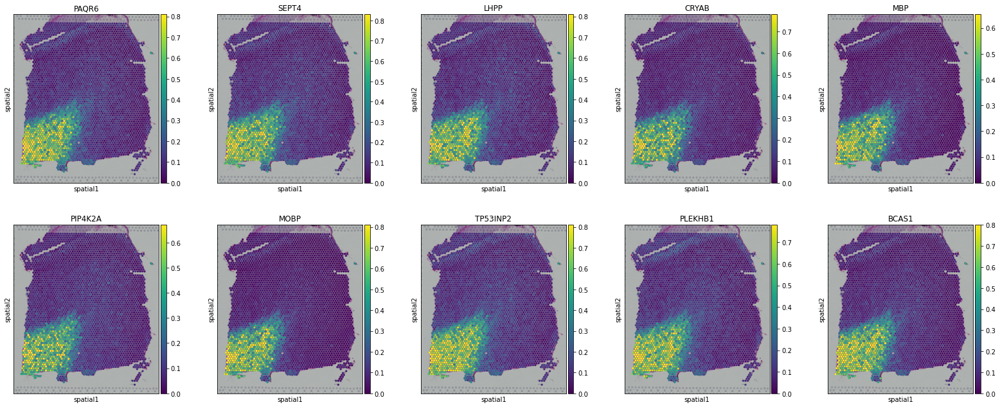

Pianno: a probabilistic framework automating semantic annotation for spatial transcriptomics

------

`pianno` is a Python package that automatically annotates the biological identity of spots in spatial transcriptomics based on marker genes. 

[TOC]

# System Requirements

## Hardware Requirements

`pianno` package requires a computer with enough RAM to support the in-memory operations.

## Software Requirements

### OS Requirements

`pianno`  package is developped on *Linux* and has been tested on CentOS v7.5.1804 and Windows10 currently. The version suitable for other operating systems is under development. Stay tuned for updates on *https://github.com/yuqiuzhou/Pianno*.

### Python Dependencies

The following dependencies will be installed along with pianno.

```python
'anndata==0.8.0',
'matplotlib==3.5.1',
'numpy==1.19.5',
'opencv-python==4.5.5.64',
'pandas==1.4.1',
'rpy2==3.4.5',
'scanpy==1.9.1',
'scikit-image==0.19.2',
'scikit-learn==1.0.2',
'scipy==1.8.0',
'protobuf==3.20.3',
'squidpy==1.2.2',
'keras==2.6.0',
'tensorflow-gpu==2.6.0',
'tensorflow-probability==0.14.0'
```

### R Dependencies

Pianno uses the R packages `SAVER` and `scran` in preprocessing for noise reduction and size factor calculation, respectively. These two R packages will be automatically installed during the corresponding analysis in Pianno.

```python
'r-scran==1.28.2',
'r-saver==1.1.2'
```

### **Web Application**

The code of the demo is prototyped and explained on the Jupyter Notebook.


# Installation Guide

## Install from PyPi

```bash
# create an environment called Pianno
conda create -n Pianno python=3.9.10

# activate your environment
conda activate Pianno

# install R in the Pianno environment
conda install -c conda-forge r-base=4.1.1

# install tensorflow and tensorflow-probability
# ensure the version 2 of tensorflow
pip install tensorflow-gpu==2.6.0
pip install tensorflow-probability==0.14.0

# install pianno from PyPi
pip install pianno
```

The installation time-consuming tested on CentOS v7.5.1804 was 2m46.585s.


# Demo

Here we present our annotation process of sample 151674 from the human dorsolateral prefrontal cortex (dlPFC) dataset. The raw data are available at http://spatial.libd.org/spatialLIBD/. This demo demonstrates how to perform semantic annotation using Pianno takes a 10x Visium dataset as an example. You can expand to spatial transcriptome data generated by other platforms.

## Import Modules

```python
import pianno as po
```

# Preprocessing

### Step1：Create Pianno Object

###### A Pianno object is initialized based on the raw gene counts matrix and the coordinates of the spatial spots. pre-processing, including calculation of size factor and quality control, is also performed.

- **Input**


```python
data_path = "~/data/dlPFC-151674/"
count_file = "filtered_feature_bc_matrix.h5"
adata = po.CreatePiannoObject(data_path=data_path, count_file=count_file, min_spots_prop=0.01)
```

Expected run time: 0 h 0 min 60 s

- **Output**

```
[1] "load scran successfully"
```

- **Outcomes**

```python
# overview of the Pianno object
AnnData object with n_obs × n_vars = 3673 × 14711
    obs: 'in_tissue', 'array_row', 'array_col', 'n_counts', 'SizeFactor'
    var: 'gene_ids', 'feature_types', 'genome', 'n_cells'
    uns: 'spatial'
    obsm: 'spatial'
    layers: 'RawX'
```

| Key                     | Content                                            | Type   |
| :---------------------- | -------------------------------------------------- | ------ |
| adata.layers['RawX']    | row gene counts matrix                             | array  |
| adata.obsm['spatial']   | coordinates of spatial spots                       | array  |
| adata.obs['SizeFactor'] | size factor of spatial spots calculated by `scran` | series |

- **Notes**

For your own datasets that are not from 10x Visium, Pianno objects can also be constructed directly from a spot-by-gene raw counts matrix A and a spatial coordinates data frame B：

```python
adata = po.CreatePiannoObject(count_matrix=A, coordinates=B, min_spots_prop=0.01)
```


###### Noise reduction via SAVER.

- **Input**

```python
adata = po.SAVER(adata, layer_key='DenoisedX')
```

Expected run time: 2 h 17 min 23 s

This step will take a long time. We provide a denoised object which can be loaded with the following command if you don't want to wait:

```python
adata = sc.read("~/data/dlPFC-151674/adata.h5ad")
```

- **Output**

```
[1] "load SAVER successfully"
```

- **Outcomes**

```python
# overview of the Pianno object
AnnData object with n_obs × n_vars = 3673 × 14711
    obs: 'in_tissue', 'array_row', 'array_col', 'n_counts', 'SizeFactor'
    var: 'gene_ids', 'feature_types', 'genome', 'n_cells'
    uns: 'spatial'
    obsm: 'spatial'
    layers: 'RawX', 'DenoisedX'
```

| Key                       | Content                         | Type  |
| :------------------------ | ------------------------------- | ----- |
| adata.layers['DenoisedX'] | denoised gene expression matrix | array |

- **Notes**

You can also choose other methods of noise reduction and just store the spot-by-gene denoised matrix into `adata.layers['DenoisedX']`. Noise reduction of spatial transcriptome data is necessary for annotation. The result of noise reduction directly affects the annotation.


## Step2：Create Mask Image

###### A binary mask is created by establishing a mapping between spatial spots and image pixels.

- **Input**


```python
# Adjust the size of the scale_factor according to the Mask Image
adata = po.CreateMaskImage(adata, scale_factor=1)
```

Expected run time: 0 h 0 min 1 s

- **Output**


    

- **Outcomes**

```python
# overview of the Pianno object
AnnData object with n_obs × n_vars = 3673 × 14711
    obs: 'in_tissue', 'array_row', 'array_col', 'n_counts', 'SizeFactor', 'spotID'
    var: 'gene_ids', 'feature_types', 'genome', 'n_cells'
    uns: 'spatial', 'Mask'
    obsm: 'spatial'
    layers: 'RawX', 'DenoisedX'
```

| Key                 | Content                                         | Type   |
| ------------------- | ----------------------------------------------- | ------ |
| adata.uns['Mask']   | tissue mask image                               | array  |
| adata.obs['spotID'] | pixel ID on the mask corresponding to each spot | series |

- **Notes**

This procedure is equivalent to binning spatial spots. For datasets whose spatial coordinates are array-like, the scale factor can be set to 1. For datasets whose spatial coordinates are not array-like, such as SlidseqV2 and stereo-seq, the scale factor can be increased until a suitable mask image is output.


# Annotation


```python
# Setting the data and configuration file storage path.
sample_name = "GT151674"
config_path = "./Tutorials/" + sample_name
```

### (Optional) Step1：Automatic hyper-parameter selection


```python
# Specify a known marker gene for each pattern
Patterndict = dict(L1 = ['CXCL14'],
                   L2 = ['HPCAL1'],
                   L3 = ['CALB1'],
                   L4 = ['NEFH'],
                   L5 = ['PCP4'],
                   L6 = ['KRT17'],
                   WM = ['MOBP'])
```


```python
# If the connection fails, try a few more times.
# Open the Web UI URLs to visualize the hyperparameter tuning process.
# The default experiment lasts for a maximum of 10 minutes, 
# which can be modified according to the actual situation.
adata = po.AutoPatternRecognition(adata,
                                  Patterndict=Patterndict,
                                  config_path=config_path,
                                  param_tuning=True,
                                  max_experiment_duration='10m')
```

    Configuration path of Pianno: /home/yqzhou/JUPYTER/Revision/Tutorials/GT151674
    [2024-01-17 22:50:09] Creating experiment, Experiment ID: 5sfyr2op
    [2024-01-17 22:50:09] Starting web server...
    [2024-01-17 22:50:10] Timeout, retry...
    [2024-01-17 22:50:11] Timeout, retry...
    [2024-01-17 22:50:12] Timeout, retry...
    [2024-01-17 22:50:13] Setting up...
    [2024-01-17 22:50:14] Web UI URLs: http://127.0.0.1:8080 http://10.10.10.7:8080 http://11.11.11.7:8080
    [2024-01-17 23:00:35] Stopping experiment, please wait...
    [2024-01-17 23:00:38] Experiment stopped
    WARNING: Please specify a valid `library_id` or set it permanently in `adata.uns['spatial']`


    


```python
# Print the optimal parameters saved in the previous step.
with open(join(config_path, "best_params.json"),'r') as f:
    best_params_dict = json.load(f)
for key in best_params_dict:
    best_params = best_params_dict[key]  
best_params
```


    {'n_class': 3,
     'dilation_radius': 1.0,
     'denoise_weight': 0.02,
     'unsharp_radius': 3.0,
     'unsharp_amount': 3.0,
     'gaussian_blur': 3.0}


### (Optional) Step2：Marker Selection


```python
# Take the top 10 DEGs as candidate marker genes to make a proposed patterndict
Patterndict = po.ProposedPatterndict(adata, top_n=10)
```


```python
# Visualization of candidate marker genes
for k, v in Patterndict.items():
    print(k)
    print(v)
    with mpl.rc_context({'axes.facecolor':  'black',
                         'figure.figsize': [4.5, 5]}):
        sc.pl.spatial(adata, #cmap='magma',
                      layer='DenoisedX',
                      color=v,
                      ncols=5, size=5,
                      spot_size=25,
                      vmin=0, vmax='p99'
                     )
```

    L1
    ['FABP7', 'S100A6', 'MSX1', 'SLC7A11', 'RELN', 'CST3', 'RXRG', 'MT1H', 'CXCL14', 'MT1G']


    


    L2
    ['MYH11', 'ALB', 'ADAMTS1', 'CUX2', 'LAMP5', 'CAMK2N1', 'HPCAL1', 'PENK', 'C1QL2', 'SOWAHA']


    


    L3
    ['CIDEC', 'JHY', 'FABP4', 'ADH1B', 'AC012645.3', 'SAA2', 'CARTPT', 'SAA1', 'CALB1', 'FREM3']


    


    L4
    ['SYT2', 'FMO2', 'FDCSP', 'SMPX', 'NEFM', 'NEFH', 'SLC25A34', 'DLGAP1-AS3', 'PRPH2']


    


    L5
    ['ZBED9', 'COLCA2', 'MEPE', 'HCG17', 'PI15', 'PCP4', 'TRABD2A', 'HS3ST2', 'NPY2R']


    


    L6
    ['IGHG3', 'KRT17', 'SEMA3E', 'CPB1', 'FCGR3B', 'HMOX1', 'IGHG1', 'CGA', 'HBB', 'IGHG4']


    


    WM
    ['PAQR6', 'SEPT4', 'LHPP', 'CRYAB', 'MBP', 'PIP4K2A', 'MOBP', 'TP53INP2', 'PLEKHB1', 'BCAS1']



    


### Step3：Initial Pattern Recognition


```python
# Construct the marker list by selecting 1-3 high-quality genes for each pattern 
# from the above candidate marker genes.
Patterndict = dict(L1 = ['CXCL14','MT1G','FABP7'],
                   L2 = ['HPCAL1','C1QL2'],
                   L3 = ['CALB1','LINC01007'],
                   L4 = ['NEFH','SYT2','NEFM'],
                   L5 = ['PCP4','TMSB10'],
                   L6 = ['KRT17'],
                   WM = ['MOBP','MBP'])
```


```python
# Patterndict can also be an integer N. Pianno will select the Top N candidate marker genes to construct the Marker List.
adata = po.AutoPatternRecognition(adata,
                                  Patterndict=Patterndict,
                                  config_path=config_path,
                                  param_tuning=False)
```

    WARNING: Please specify a valid `library_id` or set it permanently in `adata.uns['spatial']`


    


### Step4：Annotation Improvement


```python
adata = po.AnnotationImprovement(adata)
```

    ---Create Spatial Graph: Done!
    ---Compute Spatial Energy: Done!
    ---Find K-Nearest Neighbor in UMAP: Done!
    ---Compute KNN Energy: Done!
    ---Compute Global Energy: Done!
    WARNING: Please specify a valid `library_id` or set it permanently in `adata.uns['spatial']`
    WARNING: Please specify a valid `library_id` or set it permanently in `adata.uns['spatial']`
    WARNING: Please specify a valid `library_id` or set it permanently in `adata.uns['spatial']`


    


    


    

